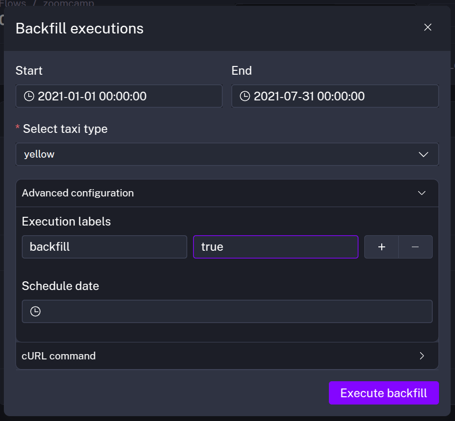
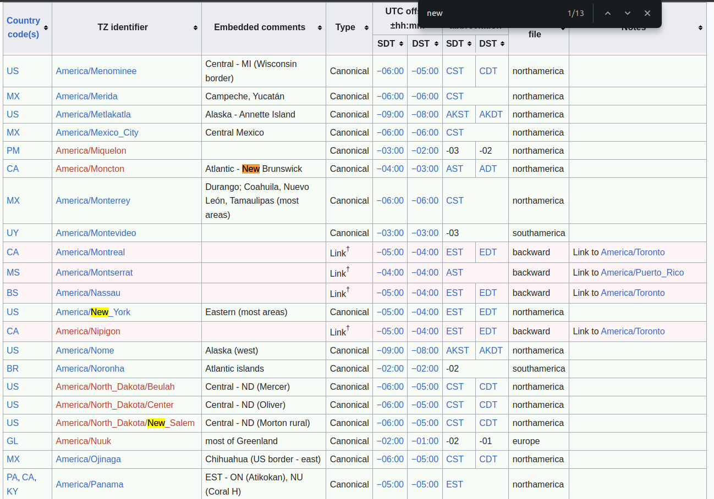

## Module 2 Homework

### Quiz Questions

Complete the Quiz shown below. It’s a set of 6 multiple-choice questions to test your understanding of workflow orchestration, Kestra and ETL pipelines for data lakes and warehouses.

1) Within the execution for `Yellow` Taxi data for the year `2020` and month `12`: what is the uncompressed file size (i.e. the output file `yellow_tripdata_2020-12.csv` of the `extract` task)?
- 128.3 MB
- 134.5 MB
- 364.7 MB
- 692.6 MB

#### Answer
The size of the file `yellow_tripdata_2020-12.csv` in the bucket is **128.3 MB**. 


2) What is the rendered value of the variable `file` when the inputs `taxi` is set to `green`, `year` is set to `2020`, and `month` is set to `04` during execution?
- `{{inputs.taxi}}_tripdata_{{inputs.year}}-{{inputs.month}}.csv` 
- `green_tripdata_2020-04.csv`
- `green_tripdata_04_2020.csv`
- `green_tripdata_2020.csv`

#### Answer 
In this case, the rendered value of this variable is `green_tripdata_2020-04.csv`.


3) How many rows are there for the `Yellow` Taxi data for all CSV files in the year 2020?
- 13,537.299
- 24,648,499
- 18,324,219
- 29,430,127

#### Answer 
SQL query
```sql
SELECT COUNT(*) 
FROM `trip_data_all.yellow_tripdata` 
WHERE filename LIKE 'yellow_tripdata_2020%';
```

We got the answer **24,648,499**.

4) How many rows are there for the `Green` Taxi data for all CSV files in the year 2020?
- 5,327,301
- 936,199
- 1,734,051
- 1,342,034

#### Answer 
SQL query
```sql
SELECT COUNT(*) 
FROM `trip_data_all.green_tripdata` 
WHERE filename LIKE 'green_tripdata_2020%';
```

We got the value **1,734,051**.

5) How many rows are there for the `Yellow` Taxi data for the March 2021 CSV file?
- 1,428,092
- 706,911
- 1,925,152
- 2,561,031

#### Answer
In this case, we first use the flow `06_gcp_taxi_scheduled` and run a backfill execution like on the image.


SQL query 
```sql
SELECT COUNT(*) 
FROM `rip_data_all.yellow_tripdata` 
WHERE filename LIKE 'yellow_tripdata_2021-03%';

```

We get the answer : **1,925,152**

6) How would you configure the timezone to New York in a Schedule trigger?
- Add a `timezone` property set to `EST` in the `Schedule` trigger configuration  
- Add a `timezone` property set to `America/New_York` in the `Schedule` trigger configuration
- Add a `timezone` property set to `UTC-5` in the `Schedule` trigger configuration
- Add a `location` property set to `New_York` in the `Schedule` trigger configuration  

#### Answer 
In the description of the `timezone` in Kestra, they precise that the timezone identifier is the second column in the Wikipedia table. When we check this table we got this : 



So, the answer is **Add a `timezone`  property set to `America/New_York` in the Schedule trigger configuration**.
